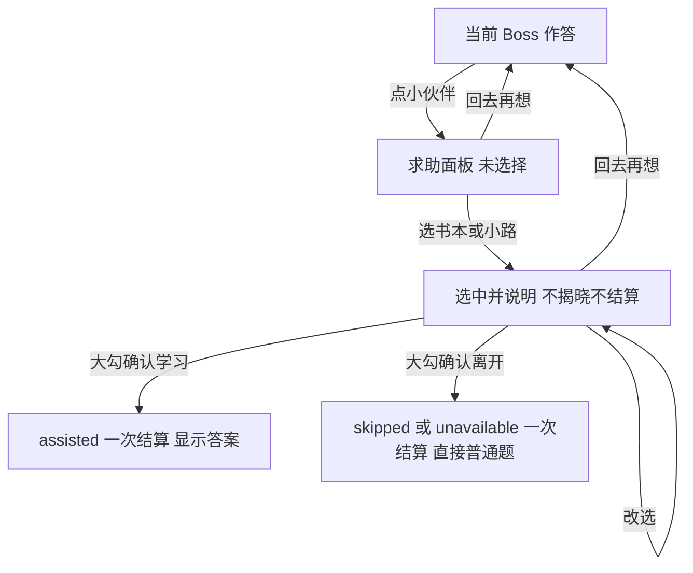

# Boss 控件自明性与误触保护改进方案

日期：2026 年 10 月 3 日。状态：已实施，11 项规则与 23 项真实 Chromium 回归通过，独立复核与原生语音探针通过；新交互尚未经过孩子试玩或目标设备人耳试听。

推荐模型：作答区保留听音、改字、检查答案，另设一个安全的求助入口。打开求助、点图卡了解用途、改选和返回都保留本次挑战；同一面板中另点大勾，才揭晓答案或离开挑战。图卡选择时用中文讲清后果，图示与位置保持稳定。

这套操作复用现有选图 Boss 的“先选图、再提交”，将误触保护放在答案揭晓之前。它多一次执行动作，不保证孩子已经理解，也不保证连续随机点击绝不结束。试玩时需验证孩子能否按自己的意图使用控件。

本文是 [动态 Boss 设计](boss-design.md) 的控件补充，已覆盖原方案的看答案、跳过及听音故障继续入口和退出落点；取材、判题、首次独立成功、五次双倍与保存规则继续由原方案定义。裁决过程见 [设计审查记录](boss-controls-design-review.md)。

## 需求与证据边界

| 来源 | 必须保留的要求或已知事实 |
| --- | --- |
| 用户本次试玩反馈 | 孩子近 5 岁，不识按钮文字；需要视觉和听觉提供用途信息，尤其看答案包含结束奖励挑战的后果 |
| 用户本次试玩反馈 | 误触造成的奖励机会损失可能让孩子退出；孩子可能不知道看答案会结束本次奖励挑战 |
| 本方案据反馈提出的保护目标 | 打开求助、探索图卡与返回都保留本次挑战，最终执行才结束 |
| 用户后续请求 | 已授权使用 bounded-delegation 实施本方案；奖励玩法沿用既有决定 |
| 用户既有决定 | Boss 可跳过，三种题型动态取材；同 emoji 多正确；成功奖励接下来五道普通题翻倍 |
| 已实现的规则与测试 | 首次有效错答结束，看答案记 assisted，正常退出记 skipped，听音故障记 unavailable；辅助跟练不能补发 Buff |
| 当前消费者与运行模型 | 孩子与家长，本地 HTML，桌面键盘和触屏；单页面事件循环，共用语音合成，有取消、故障和迟到回调 |
| 当前持久化 | 一个 version 1 对象保存积分、Buff、遇敌计数和 History；题面与输入仅在内存，没有求助记录或教学进度需求 |
| 本方案的原型裁决 | 单面板内选择后执行；不以中文说明播放成功作权限门锁；退出确认后直接普通题 |

不识字与误触后离开是家长提供的试玩证据；不能由此推算误触频率或证明某图标一定容易理解。单面板、执行按钮与话术是经设计审查后获授权实施的原型，仍需验证儿童操作效果。

实施前发现的三个接入问题：

- 原 answer/skip/audio-continue 监听器直接调用 `finishBoss`；点击孩子不理解的按钮，也会立即结束并结算。
- 原 `finishBoss` 对 skipped/unavailable 也显示、朗读答案，并停在 Boss 结束页。将“继续普通题”做成真正直接继续，是本方案明确的行为改变。
- image 图案点击只更新选择，`submitBoss` 才判题。原生 modal 不能阻止文档级键盘处理；中文说明也不能沿用所有 active Boss 音频错误都写 `audioFailed` 的分支。

现在的 [word-adventure.html](../word-adventure.html) 以 `openHelp`、`chooseHelp`、`closeHelp`、`confirmHelp` 接入求助；主入口为 `#help`，故障 `#audio-continue` 也只打开 `#help-dialog`。原 `#answer`、`#skip` 已移除，普通题和纯规则文件沿用原模型。

## 主画面的固定控件

| 控件 | 图示和用途 | 声音说明 | 点击行为 |
| --- | --- | --- | --- |
| 再听 | 沿用喇叭或耳朵图案，放在听音位置 | “点耳朵，再听一遍。” | 重播目标英文，不透露拼写或正确图案 |
| 改一个字母 | 大退格键形状，与实体键盘的退格一致 | “退格可以擦掉一个字母。” | 删除一个已输入字母；image 不显示 |
| 检查答案 | 大勾与作答卡，靠近作答区 | “想好了，点大勾检查。” | 仍须输入完整或选图，并已完整听到目标英文 |
| 帮帮我 | 固定的小伙伴加提问气泡，放在独立辅助区 | “需要帮助，点小伙伴。” | 只打开求助面板 |

主画面不再并列放看答案与下次再来两个直接终结按钮；故障继续入口同样先进入求助面板，不能留下另一条误触旁路。image 有三个主操作，两个拼写题型有四个；大小写键与字母键继续沿用已有操作。

图示应大于其附属文字，采用稳定的内嵌 SVG 或已有图形即可；保留中文文字和可访问名称供家长使用。同一用途的图案跨面板与结果页一致，不能只用颜色区分。各控件之间留出清楚的间隔，并在 390 px 窄屏上检查位置与点击范围。

沿用现有 Boss 入场语音，用短句点名耳朵、大勾和小伙伴；拼写题再说明退格可修改。点名时可短暂强调相应控件，然后播放目标英文。它是现有入场提示的改进，不增加教程完成标志或独立教学关卡。首次使用可由家长示范一次，之后观察孩子是否独立操作。

这一版不建设所有按钮的悬停朗读系统。触屏可以通过安全入口与图卡选择得到语音；既有字母悬停继续保留，但求助面板打开时暂停。图示单一含义、避免堆积是 [W3C 图标建议](https://www.w3.org/WAI/WCAG2/supplemental/patterns/o1p07-icons-used/)支持的通用原则，不是本方案经过儿童实验的证明。

## 一个可以探索的求助面板

面板只使用与目标词无关的固定小伙伴和图示；image 挑战中不得出现目标中文、英文、正确图案标记或来源词。保留背景原题，不重新抽词、不重新生成遮挡位置。

进入时没有默认选择，执行按钮禁用；“回去再想”始终可用并取得初始焦点。先播放短说明：“这里可以找帮助。回头箭头，可以回去继续想。”两张图卡是选择入口，返回按钮是第三个去向：

| 去向 | 图示与反馈 | 中文说明候选 | 此次点击的结果 |
| --- | --- | --- | --- |
| 我再试试 | 思考的小伙伴、向回箭头；作为清楚的大返回按钮 | “回去继续想，刚才填的还在。” | 立即返回原题，不写历史、不结束 |
| 一起学答案 | 小伙伴打开书；选中时有边框和选中标记 | “一起看答案，这次不拿双倍能量。想一起学，就点大勾；回头箭头可以继续想。” | 只选中并解释，不揭晓 |
| 去普通关 | 小伙伴走向普通关卡的小路，向前箭头 | “回普通关，这次先不拿双倍能量。要走就点大勾；回头箭头可以继续想。” | 只选中并解释，不离开 |

选中学习或离开后，启用固定位置的大勾执行按钮；按钮图示与主画面的提交一致，文字按选择显示“一起学”或“去普通关”。选择图卡不自动聚焦执行按钮，反复选择、改选仍只是解释当前选择。返回后再打开，从未选状态开始。

图卡强调将要做的动作。五颗能量只是答对后的潜在奖励，不能画成已获得的能量被扣除或破碎。需要展示收益比较时，用思考与未点亮的奖励目标、书本学习画面表达；不要让颜色、五颗图标或文字独自承担后果说明。

正常学习与退出均为三次操作：打开、选择、执行。相较图卡直接执行的方案，学习路径确实多一次操作。保护承诺限于打开、图卡探索、改选与返回；最终执行仍有误点风险，需要真实试玩，不用更多确认层数掩盖。

## 执行后的落点与奖励

| 已确认动作 | 历史与奖励 | 画面落点 |
| --- | --- | --- |
| 一起学答案 | 仍为 assisted，一条记录，无新积分与 Buff | 显示、朗读答案，沿用跟练和继续普通题 |
| 正常去普通关 | 仍为 skipped，一条记录，重抽遇敌计数，不加奖、不扣分 | 结算成功后直接 `startWord(false)`，不先展示或朗读 Boss 答案 |
| 目标听音故障时去普通关 | 仅当目标英文未完整播放且已有实际播放故障，仍为 unavailable | 同样直接普通题；说明此次为声音问题 |

故障时，用现有故障继续入口打开同一面板，并明确将离开图卡表述为“声音没播放，继续普通题”，以划掉的喇叭配普通关卡图示；选中说明也要讲声音原因。健康状态的同一卡表示正常跳过。这是基于已有目标听音故障状态的派生显示，不增加第四张卡或额外持久化原因。

选择“学习”仍记 assisted，即使曾发生目标听音故障。已经成功听过目标、随后重听失败时，保留资格，离开仍是正常 skipped。新按钮说明的中文故障不能生成上述目标故障状态。浏览器完全不支持朗读的既有 unavailable 自动结束，也采用直接普通题落点。

退出必须先经过原结算入口，再开始普通题；在 `finishBoss` 的结算成功之后、答案渲染和答案朗读之前分支。不要先完整调用旧的结果展示流程，再马上换题。若结算因核心数据异常被暂停，不能强行开下一题；存储写入失败则仍按原约定继续内存游玩并显示提示。

辅助结果页的“跟着拼”和“去普通关”也是当前不识字孩子的真实路径：前者用写字卡或手指跟拼图，后者复用走向普通关卡图，答案朗读后给一句用途说明。成功页的大箭头则带已获得的五颗能量，并说明“带着双倍能量出发”。沿用已有跟练、庆祝完成后可继续等行为，不新增奖励入口。

答案出现后，不能通过返回或跟练恢复同题独立奖励资格。正常答题的首次错答仍按原方案终结；本轮修复的是操作理解和误触边界，不增加补奖、第二次提交机会或立即换 Boss 重试。

## 最小状态与事件边界

优先使用一个静态原生 `<dialog>`，以 `dialog.open` 作为开闭权威；唯一新增选择事实为 `helpChoice = null | 'learn' | 'leave'`，只在内存中。执行可用性从面板开启、题目未结束及选择非空派生。共有关闭、打开未选、打开选学习、打开选离开四种可达 UI 状态；不另外维护 phase、ready、committed、面板快照或已听说明标志。

原生 modal 提供基础模态和焦点行为，使用 `showModal()` 与 `close()`；返回按钮设置初始焦点，Escape 走相同返回路径。标准支持这些基础能力，但不会替应用屏蔽文档级游戏监听器。[HTML dialog 标准](https://html.spec.whatwg.org/multipage/interactive-elements.html#the-dialog-element)

接入必须满足以下边界：

1. 打开求助时清除按键保持和 hover，取消当前语音及入场音效；不改变 `currentTask`、输入、选图、遮挡位置、`heardTarget` 或持久化进度。不调用 `settle`、`startWord` 或答案渲染。
2. 面板打开时，背景字母、退格、选图、提交、大小写切换、hover 与空白点击恢复提示均不处理。原生 inert 之外，`document.keydown` 等全局处理器及游戏命令入口还需检查同一面板状态。
3. Enter/Space 只按当前面板中聚焦控件的用途工作，不把 Enter 泛化为执行当前选择；长按重复事件不能激活执行。执行按钮不覆盖求助入口或选择卡的原点击区域，同位置连点不能穿透两步。在桌面和触屏实际检查此几何条件，不增加通用 debounce 框架。
4. 返回取消说明音频，清除 `helpChoice`，保留原题所有作答内容和既得资格。目标词此前未完整听完时，返回后重播完整目标；已经听完时不强迫重听。焦点返回求助入口。
5. 保留现有唯一 `audioGeneration`；开启、切换说明和关闭都会失效旧音频。回调只能影响当前题、当前选择及仍开启的面板；离开面板或开始新题后，旧说明和旧目标回调不得改变任何资格或结算。
6. 最终执行仍使用 `finishBoss` 的 complete 先置真及一次结算防护。关闭面板的清理不得在终结后重播旧目标，也不得被迟到 close 回调带入新题。两张图卡、返回与说明事件都不增加历史记录。

只扩展当前 HTML 的局部控件、语音用途分支和事件守卫。`word-adventure-game.js` 的取材、判题和结算接口不需要改变；两个 localStorage key、version 和 History 结构不迁移，关闭未结束面板仍沿用未完成题不保存的规则。返回时保留已有输入也符合 [W3C 的返回与误操作恢复建议](https://www.w3.org/WAI/WCAG2/supplemental/patterns/o4p02-back-undo/)，不是增加一套恢复存档的理由。

## 说明语音与故障

新增语音只承担控件说明，复用现有播放器和 generation，使用明确的 controls/help 用途。所有说明步骤均不带 `target`；完成、失败、跳过中文或取消，都不得写 `heardTarget`、目标 `audioFailed`、outcome 或进度。

入场、面板及结果页的新用途说明与现有目标播放区分失败来源。`playSequence` 按步骤用途做局部分支，只有目标英文自身失败才可设置目标故障。入场控件说明失败或被跳过时，仍继续播放目标英文；Boss 结果页的中文释义失败，也继续尝试后面的按钮用途说明，不吞掉继续／跟练的声音信息。缺中文时序列继续到 finish，也不能宣称孩子已听到后果。

入场说明和图卡说明均拆为现有播放器的短步骤，沿用每条 10 秒 watchdog；不将整段慢速中文塞进一条播放。入场保留“挑战成功，接下来五题双倍”的奖励说明。

说明不抢占正在播放的目标词，除非孩子明确打开求助；选图卡则取消旧说明、播放当前选择的短说明。返回后取消说明；不缓存待播控件列表，不引入多套优先级调度。

不增加“成功听完中文才可执行”的硬门锁。选择与执行的分离负责防止图卡探索直接终结，语音负责解释，二者不假装证明理解。说明播放失败时，在原图卡上显示重听图示并给简短家长提示，重点击图卡即可再次说明，不增设一个重播按钮。返回、改选、执行仍可用；不能超时默认执行或自动选择离开。

不设门锁意味着孩子仍可能在声音未播放完或无法播放时确认。这是明确的剩余风险，首次试玩必须确认关键说明可听，并观察执行是否符合孩子意图。目标设备无法提供这些声音时需要家长协助，不能声称此时孩子仍可完全自主理解；固定中文录音可作为出现真实声音缺口后的后续方案。

## 实现与验收

本次改动集中在 [word-adventure.html](../word-adventure.html) 与 [浏览器回归](../tests/boss-browser.test.cjs)：固定 SVG 图示、短入场说明、同面板选择与解释、原题保留、背景与语音隔离、assisted 答案页、退出直达普通题及结果页图示。已覆盖 recall、partial、image，没有新增运行依赖、规则接口或存档字段。

保留原规则回归；浏览器测试已替换一击看答案／跳过与 unavailable 停结束页的旧断言，按新交互检查。受控语音回调验证事件边界，另有未替换语音合成的原生探针；两者都不等于人耳试听。

2026 年 10 月 3 日最终验收：

| 检查 | 实际结果与边界 |
| --- | --- |
| 纯规则 | `node --test tests/boss-rules.test.cjs`，11/11 通过；规则文件与词库未改动 |
| 真实浏览器 | `tests/boss-browser.test.cjs`，23/23 通过；保留原 12 项，新增 11 项，覆盖下表事件与 Boss 结果中文释义失败后继续说明 |
| 独立复核 | 只读源码复核与 4 条组合 Chromium 轨迹通过；包含原生键盘操作、跨新 Boss 的旧回调、同步语音抛错及 assisted 结果跟练 |
| 原生语音 | 未 mock 语音合成；学习／离开两卡的后果与勾、返回说明均观察到原生 end。探索不改进度，返回后 BIKE 完整播放授权提交；成功记录一次 image/correct、授予五次 Buff，分数保持 10.5 |
| 视觉与几何 | 已查看桌面与 390 px 帮助面板、窄屏 recall；返回／勾与两卡区分清楚，执行位置不与入口／图卡重叠；浏览器几何断言与真实鼠标／触屏连点通过 |
| 语法与文件 | 内联 JavaScript 语法和 `git diff --check` 通过；没有新增运行依赖或存档迁移 |
| 未覆盖 | 目标设备扬声器与发音质量、孩子是否理解图示和后果、额外一步对体验的影响；这些需要实际试玩 |

截图、原生语音与独立复核探针结果保留在本地忽略目录 `work/boss-controls-implementation/`。执行命令与临时 Playwright 依赖路径见 [原设计的验收说明](boss-design.md#已落地的实现与验收)。

| 必须验收的事件轨迹 | 预期结果 |
| --- | --- |
| 误点求助、立即返回 | 原输入、选图、遮挡与既得听音资格不变；History、积分、Buff、遇敌计数及 setItem 调用不变 |
| 求助图卡快速点击、反复选择、改选 | 仅选中并解释；不出现答案，不离开，不结算；初始不能执行，改选后执行当前选择 |
| 同位置双击、触屏连点、长按 Enter/Space | 不穿透入口或图卡至最终执行；默认焦点返回，未明确聚焦执行时不提交 |
| 原生 modal 内按字母、退格、空白处 Enter/点击 | 不改背景作答、不提交、不恢复或抢播目标提示 |
| partial 填一格、image 选一项后开关面板 | 原掩码和选项位置固定，已填或已选保留；不免费换题 |
| 已听完目标后返回，或未听完时取消后返回 | 前者仍有资格；后者必须完整重听，旧英文 onend 不授予资格 |
| 旧说明、改选前说明、旧目标的迟到 onend/onerror | 不改变新选择、目标资格、故障归因或题目结果，不触发恢复旧题 |
| 中文说明缺失、播放拦截、failed、timeout、失焦 | 无结果；不改目标故障字段；始终可返回与明确选择，无自动终结 |
| 确认学习，再重复执行及跟练 | 只有一条 assisted，无奖励；出现答案后不能恢复同题独立资格 |
| 确认正常离开 | 一条 skipped，重置遇敌计数，直接正常题，不渲染/朗读 Boss 答案，不扣钱、不多一次继续按钮 |
| 真实目标故障的继续，与成功听过后的重听失败 | 前者明确 unavailable 并直达普通题；后者仍可答题或正常 skipped；说明故障不制造 unavailable |
| 成功、首次错误、五次双倍、同 emoji 多正确 | 原规则不变；第五次仍双倍、第六次原奖；同题仍只结算一次 |
| 关闭面板期间的页面重开、写入失败、坏存档 | 沿用原未完成题与存储约定，不增加面板存档或撤销账本 |
| 桌面与 390 px 窄屏 | 图案清楚、控件分区、对比不只靠颜色、执行按钮不与入口/图卡点击位置重合，无横向溢出 |

还须做一次孩子实际使用观察：家长示范后停止逐按钮指路，让孩子按自己的意图重听、改字、检查、开求助再返回；让他点两张图卡听说明但先不执行，观察是否知道选中仍可返回；最后观察有意学习与有意去普通关是否到达预期画面。用行为检验，不能只问“听懂了吗”。

特别记录多一次执行是否让他困惑或退出。若图卡已能稳定表达意图、而执行步骤持续造成负担，可以再比较图卡直接执行的更短方案；需要重新接受“图卡探索也可能终结”的风险。这里没有自动验证儿童理解或保证降低退出率的结论。

## 简化与后续触发条件

| 项目 | 裁决 | 重新考虑的条件或保留原因 |
| --- | --- | --- |
| 看答案、跳过、故障继续的独立主入口 | merge | 一个安全求助入口与面板覆盖真实终结路径 |
| 图卡即执行 | simplify | 改成同面板选择再执行，复用已有选图提交语法；保留探索边界 |
| 原题输入、听音资格、generation、唯一结算 | keep | 删除会清空进度、产生旧回调授权或重复结算 |
| 后果语音成功门锁 | defer | 出现“来不及听就确认”的实际问题，且已决定中文不可用时如何自主退出 |
| 第二层确认、长按与家长批准 | defer | 同面板选择执行仍有具体持续误触，再比较成本；不无限叠加确认 |
| 独立恢复快照、第二套音频世代、committed、exploration outcome | delete | 现变量、generation、complete 与既有 outcome 已拥有这些责任 |
| 全控件 hover、通用 TTS 或 dialog 框架 | defer | 出现多个真实消费者和重复实现；当前触屏不能依赖 hover |
| 教学完成存档、探索日志和仪表盘 | defer | 实际需要跨次教学或家长长期统计，而非仅为本次诊断 |
| 固定中文录音 | defer | 目标设备关键说明持续无法播放或不清楚；届时确认资源与播放失败边界 |
| 错后补奖、第二次提交、揭晓后重来 | defer | 家长明确选择新的奖励或学习容错法则，单独设计，不夹在控件修复中 |

本轮减少的是重复入口、确认层和状态权威。保留的新增局部选择有一个明确用途：让孩子可以先了解图卡会做什么，再决定是否结束挑战。
